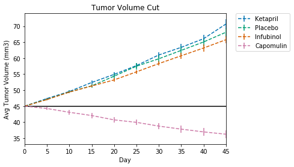

# Observations

*Capomulin performed the best in tumor reduction being the only drug that actually caused a reduction among the four drugs emphasized.

*Ketapril actually increased Tumor Volume relative to the Placebo.

*Capomulin again outperforms the others with most subjects surviving treatment.

*Infubinol saved fewer patients than the placebo.

Capomulin is the only drug that outperformed the Placebo in each metric and also outperformed each of the other drugs, making it the best drug of the trial.