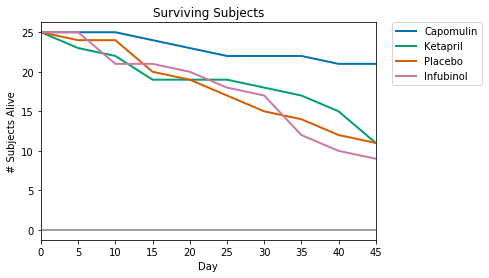

# Pymaceuticals Inc


While your data companions rushed off to jobs in finance and government, you remained adamant that science was the way for you. Staying true to your mission, you've since joined Pymaceuticals Inc., a burgeoning pharmaceutical company based out of San Diego, CA. Pymaceuticals specializes in drug-based, anti-cancer pharmaceuticals. In their most recent efforts, they've since begun screening for potential treatments to squamous cell carcinoma (SCC), a commonly occurring form of skin cancer.

As their Chief Data Analyst, you've been given access to the complete data from their most recent animal study. In this study, 250 mice were treated through a variety of drug regimes over the course of 45 days. Their physiological responses were then monitored over the course of that time. Your objective is to analyze the data to show how four treatments (Capomulin, Infubinol, Ketapril, and Placebo) compare.


```python
import matplotlib.pyplot as plt
import pandas as pd
import numpy as np
import seaborn as sns
from scipy.stats import sem
```


```python
#import mouse trial data
clinical_df = pd.read_csv('raw_data/clinicaltrial_data.csv')
clinical_df.head()
plt.style.use('seaborn-colorblind')
```


```python
#import files on which mouse recieved which drug
drug_df = pd.read_csv('raw_data/mouse_drug_data.csv')
#one mouse received 2 drugs, dropped both
drug_df.drop_duplicates(inplace=True,subset =['Mouse ID'], keep = False)
drug_df.head()

```


<div>
<style>
    .dataframe thead tr:only-child th {
        text-align: right;
    }

    .dataframe thead th {
        text-align: left;
    }

    .dataframe tbody tr th {
        vertical-align: top;
    }
</style>
<table border="1" class="dataframe">
  <thead>
    <tr style="text-align: right;">
      <th></th>
      <th>Mouse ID</th>
      <th>Drug</th>
    </tr>
  </thead>
  <tbody>
    <tr>
      <th>0</th>
      <td>f234</td>
      <td>Stelasyn</td>
    </tr>
    <tr>
      <th>1</th>
      <td>x402</td>
      <td>Stelasyn</td>
    </tr>
    <tr>
      <th>2</th>
      <td>a492</td>
      <td>Stelasyn</td>
    </tr>
    <tr>
      <th>3</th>
      <td>w540</td>
      <td>Stelasyn</td>
    </tr>
    <tr>
      <th>4</th>
      <td>v764</td>
      <td>Stelasyn</td>
    </tr>
  </tbody>
</table>
</div>


```python
merged_df = drug_df.merge(clinical_df, on = 'Mouse ID')
print(merged_df.columns)
merged_df.dropna()
maxtime = merged_df['Timepoint'].max()
mintime = merged_df['Timepoint'].min()
merged_df.head()
```

    Index(['Mouse ID', 'Drug', 'Timepoint', 'Tumor Volume (mm3)',
           'Metastatic Sites'],
          dtype='object')


<div>
<style>
    .dataframe thead tr:only-child th {
        text-align: right;
    }

    .dataframe thead th {
        text-align: left;
    }

    .dataframe tbody tr th {
        vertical-align: top;
    }
</style>
<table border="1" class="dataframe">
  <thead>
    <tr style="text-align: right;">
      <th></th>
      <th>Mouse ID</th>
      <th>Drug</th>
      <th>Timepoint</th>
      <th>Tumor Volume (mm3)</th>
      <th>Metastatic Sites</th>
    </tr>
  </thead>
  <tbody>
    <tr>
      <th>0</th>
      <td>f234</td>
      <td>Stelasyn</td>
      <td>0</td>
      <td>45.000000</td>
      <td>0</td>
    </tr>
    <tr>
      <th>1</th>
      <td>f234</td>
      <td>Stelasyn</td>
      <td>5</td>
      <td>47.313491</td>
      <td>0</td>
    </tr>
    <tr>
      <th>2</th>
      <td>f234</td>
      <td>Stelasyn</td>
      <td>10</td>
      <td>47.904324</td>
      <td>0</td>
    </tr>
    <tr>
      <th>3</th>
      <td>f234</td>
      <td>Stelasyn</td>
      <td>15</td>
      <td>48.735197</td>
      <td>1</td>
    </tr>
    <tr>
      <th>4</th>
      <td>f234</td>
      <td>Stelasyn</td>
      <td>20</td>
      <td>51.112713</td>
      <td>2</td>
    </tr>
  </tbody>
</table>
</div>


```python
#tried using this seaborn function, I think its failing when a subject in a dataline dies
#any insight would be appreciated
sns.tsplot(data = merged_df, time='Timepoint', value = 'Tumor Volume (mm3)', unit = 'Mouse ID', condition= 'Drug')
plt.show()
```

    /Users/nicksteinhauser/anaconda/envs/pydata/lib/python3.6/site-packages/seaborn/timeseries.py:183: UserWarning: The tsplot function is deprecated and will be removed or replaced (in a substantially altered version) in a future release.
      warnings.warn(msg, UserWarning)


```python
group = merged_df.groupby(['Drug','Timepoint'])

size_group = group.agg({'Tumor Volume (mm3)': ['mean', sem]}).unstack(0)
#ordering group by contents of 45th timepoint so that legend will be ranked in order of tumor volume 
#and correspond to the intersection with the graph border done later for each plot
ordered_size_group = size_group['Tumor Volume (mm3)']['mean'].T.sort_values(by=45, ascending = False).T
ordered_size_group.head()
```


<div>
<style>
    .dataframe thead tr:only-child th {
        text-align: right;
    }

    .dataframe thead th {
        text-align: left;
    }

    .dataframe tbody tr th {
        vertical-align: top;
    }
</style>
<table border="1" class="dataframe">
  <thead>
    <tr style="text-align: right;">
      <th>Drug</th>
      <th>Ketapril</th>
      <th>Naftisol</th>
      <th>Stelasyn</th>
      <th>Placebo</th>
      <th>Propriva</th>
      <th>Zoniferol</th>
      <th>Infubinol</th>
      <th>Ceftamin</th>
      <th>Capomulin</th>
      <th>Ramicane</th>
    </tr>
    <tr>
      <th>Timepoint</th>
      <th></th>
      <th></th>
      <th></th>
      <th></th>
      <th></th>
      <th></th>
      <th></th>
      <th></th>
      <th></th>
      <th></th>
    </tr>
  </thead>
  <tbody>
    <tr>
      <th>0</th>
      <td>45.000000</td>
      <td>45.000000</td>
      <td>45.000000</td>
      <td>45.000000</td>
      <td>45.000000</td>
      <td>45.000000</td>
      <td>45.000000</td>
      <td>45.000000</td>
      <td>45.000000</td>
      <td>45.000000</td>
    </tr>
    <tr>
      <th>5</th>
      <td>47.389175</td>
      <td>46.796098</td>
      <td>47.470830</td>
      <td>47.125589</td>
      <td>47.168130</td>
      <td>46.851818</td>
      <td>47.062001</td>
      <td>46.503051</td>
      <td>44.266086</td>
      <td>43.944859</td>
    </tr>
    <tr>
      <th>10</th>
      <td>49.582269</td>
      <td>48.694210</td>
      <td>49.335368</td>
      <td>49.423329</td>
      <td>48.938560</td>
      <td>48.689881</td>
      <td>49.403909</td>
      <td>48.285125</td>
      <td>43.084291</td>
      <td>42.531957</td>
    </tr>
    <tr>
      <th>15</th>
      <td>52.399974</td>
      <td>50.933018</td>
      <td>51.448025</td>
      <td>51.359742</td>
      <td>50.891769</td>
      <td>50.779059</td>
      <td>51.296397</td>
      <td>50.094055</td>
      <td>42.064317</td>
      <td>41.495061</td>
    </tr>
    <tr>
      <th>20</th>
      <td>54.920935</td>
      <td>53.644087</td>
      <td>53.970080</td>
      <td>54.364417</td>
      <td>53.127384</td>
      <td>53.170334</td>
      <td>53.197691</td>
      <td>52.157049</td>
      <td>40.716325</td>
      <td>40.238325</td>
    </tr>
  </tbody>
</table>
</div>


```python
ordered_size_group .plot( 
    yerr = size_group['Tumor Volume (mm3)']['sem'],
    linestyle = 'dashed', linewidth = 1.5
)

plt.title('Tumor Volume Full') #vs Time
plt.ylabel('Avg Tumor Volume (mm3)') #among all test subjects per drug
plt.xlabel('Day') #presumed 

plt.legend(bbox_to_anchor=(1.05, 1), loc=2, borderaxespad=0.) #note: legend is in graph endpoint order
plt.hlines(xmin = mintime,xmax = maxtime, y = 45, colors='black', linewidth = 1.5) #x axis

plt.show()
```


* Create a plot that shows how the tumor volume changes over time for each treatment.


```python

#ordering group by contents of 45th timepoint so that legend will be ranked in order of tumor volume 
#and correspond to the intersection with the graph border done later for each plot
ordered_size_group = ordered_size_group[['Capomulin', 'Infubinol', 'Ketapril', 'Placebo']]
ordered_size_group_sem = size_group['Tumor Volume (mm3)']['sem'][['Capomulin', 'Infubinol', 'Ketapril', 'Placebo']]
ordered_size_group = ordered_size_group.T.sort_values(by=45, ascending = False).T
ordered_size_group.head()
```


<div>
<style>
    .dataframe thead tr:only-child th {
        text-align: right;
    }

    .dataframe thead th {
        text-align: left;
    }

    .dataframe tbody tr th {
        vertical-align: top;
    }
</style>
<table border="1" class="dataframe">
  <thead>
    <tr style="text-align: right;">
      <th>Drug</th>
      <th>Ketapril</th>
      <th>Placebo</th>
      <th>Infubinol</th>
      <th>Capomulin</th>
    </tr>
    <tr>
      <th>Timepoint</th>
      <th></th>
      <th></th>
      <th></th>
      <th></th>
    </tr>
  </thead>
  <tbody>
    <tr>
      <th>0</th>
      <td>45.000000</td>
      <td>45.000000</td>
      <td>45.000000</td>
      <td>45.000000</td>
    </tr>
    <tr>
      <th>5</th>
      <td>47.389175</td>
      <td>47.125589</td>
      <td>47.062001</td>
      <td>44.266086</td>
    </tr>
    <tr>
      <th>10</th>
      <td>49.582269</td>
      <td>49.423329</td>
      <td>49.403909</td>
      <td>43.084291</td>
    </tr>
    <tr>
      <th>15</th>
      <td>52.399974</td>
      <td>51.359742</td>
      <td>51.296397</td>
      <td>42.064317</td>
    </tr>
    <tr>
      <th>20</th>
      <td>54.920935</td>
      <td>54.364417</td>
      <td>53.197691</td>
      <td>40.716325</td>
    </tr>
  </tbody>
</table>
</div>


```python
ordered_size_group .plot( 
    yerr = ordered_size_group_sem,
    linestyle = 'dashed', linewidth = 1.5
)

plt.title('Tumor Volume Cut') #vs Time
plt.ylabel('Avg Tumor Volume (mm3)') #among all test subjects per drug
plt.xlabel('Day') #presumed 

plt.legend(bbox_to_anchor=(1.05, 1), loc=2, borderaxespad=0.) #note: legend is in graph endpoint order
plt.hlines(xmin = mintime,xmax = maxtime, y = 45, colors='black', linewidth = 1.5) #x axis

plt.show()
```


* Create a plot that shows how the tumor volume changes over time for each treatment.


```python
metastasis_group = group.agg({'Metastatic Sites': ['mean', sem]}).unstack(0)
ordered_metastasis_group = metastasis_group['Metastatic Sites']['mean'].T.sort_values(by=maxtime, ascending = False).T
ordered_metastasis_group.head()
```


<div>
<style>
    .dataframe thead tr:only-child th {
        text-align: right;
    }

    .dataframe thead th {
        text-align: left;
    }

    .dataframe tbody tr th {
        vertical-align: top;
    }
</style>
<table border="1" class="dataframe">
  <thead>
    <tr style="text-align: right;">
      <th>Drug</th>
      <th>Ketapril</th>
      <th>Placebo</th>
      <th>Zoniferol</th>
      <th>Ceftamin</th>
      <th>Propriva</th>
      <th>Naftisol</th>
      <th>Infubinol</th>
      <th>Stelasyn</th>
      <th>Capomulin</th>
      <th>Ramicane</th>
    </tr>
    <tr>
      <th>Timepoint</th>
      <th></th>
      <th></th>
      <th></th>
      <th></th>
      <th></th>
      <th></th>
      <th></th>
      <th></th>
      <th></th>
      <th></th>
    </tr>
  </thead>
  <tbody>
    <tr>
      <th>0</th>
      <td>0.000000</td>
      <td>0.000000</td>
      <td>0.000000</td>
      <td>0.000000</td>
      <td>0.000000</td>
      <td>0.000000</td>
      <td>0.000000</td>
      <td>0.000000</td>
      <td>0.000000</td>
      <td>0.000000</td>
    </tr>
    <tr>
      <th>5</th>
      <td>0.304348</td>
      <td>0.375000</td>
      <td>0.166667</td>
      <td>0.380952</td>
      <td>0.347826</td>
      <td>0.260870</td>
      <td>0.280000</td>
      <td>0.260870</td>
      <td>0.160000</td>
      <td>0.120000</td>
    </tr>
    <tr>
      <th>10</th>
      <td>0.590909</td>
      <td>0.833333</td>
      <td>0.500000</td>
      <td>0.600000</td>
      <td>0.619048</td>
      <td>0.523810</td>
      <td>0.666667</td>
      <td>0.523810</td>
      <td>0.320000</td>
      <td>0.250000</td>
    </tr>
    <tr>
      <th>15</th>
      <td>0.842105</td>
      <td>1.250000</td>
      <td>0.809524</td>
      <td>0.789474</td>
      <td>0.800000</td>
      <td>0.857143</td>
      <td>0.904762</td>
      <td>0.809524</td>
      <td>0.375000</td>
      <td>0.333333</td>
    </tr>
    <tr>
      <th>20</th>
      <td>1.210526</td>
      <td>1.526316</td>
      <td>1.294118</td>
      <td>1.111111</td>
      <td>1.000000</td>
      <td>1.150000</td>
      <td>1.050000</td>
      <td>0.947368</td>
      <td>0.652174</td>
      <td>0.347826</td>
    </tr>
  </tbody>
</table>
</div>


```python
ordered_metastasis_group.plot(yerr = metastasis_group['Metastatic Sites']['sem'], linewidth = 1.5, linestyle = 'dashed')

plt.title('Metastatic Sites Full') #vs Time
plt.ylabel('Avg # of Metastatic Sites') #among all test subjects per drug
plt.xlabel('Day') #presumed 

plt.legend(bbox_to_anchor=(1.05, 1), loc=2, borderaxespad=0.) #note: legend is in graph endpoint order
plt.hlines(xmin = mintime,xmax = maxtime, y = 0, colors='black', linewidth = 1.5) #x axis

plt.show()
```


* Create a plot that shows how the number of [metastatic](https://en.wikipedia.org/wiki/Metastasis) (cancer spreading) sites changes over time for each treatment.


```python
ordered_metastasis_group = ordered_metastasis_group[['Capomulin', 'Infubinol', 'Ketapril', 'Placebo']]
ordered_metastasis_group = ordered_metastasis_group.T.sort_values(by=maxtime, ascending = False).T
ordered_metastasis_group.head()
```


<div>
<style>
    .dataframe thead tr:only-child th {
        text-align: right;
    }

    .dataframe thead th {
        text-align: left;
    }

    .dataframe tbody tr th {
        vertical-align: top;
    }
</style>
<table border="1" class="dataframe">
  <thead>
    <tr style="text-align: right;">
      <th>Drug</th>
      <th>Ketapril</th>
      <th>Placebo</th>
      <th>Infubinol</th>
      <th>Capomulin</th>
    </tr>
    <tr>
      <th>Timepoint</th>
      <th></th>
      <th></th>
      <th></th>
      <th></th>
    </tr>
  </thead>
  <tbody>
    <tr>
      <th>0</th>
      <td>0.000000</td>
      <td>0.000000</td>
      <td>0.000000</td>
      <td>0.000000</td>
    </tr>
    <tr>
      <th>5</th>
      <td>0.304348</td>
      <td>0.375000</td>
      <td>0.280000</td>
      <td>0.160000</td>
    </tr>
    <tr>
      <th>10</th>
      <td>0.590909</td>
      <td>0.833333</td>
      <td>0.666667</td>
      <td>0.320000</td>
    </tr>
    <tr>
      <th>15</th>
      <td>0.842105</td>
      <td>1.250000</td>
      <td>0.904762</td>
      <td>0.375000</td>
    </tr>
    <tr>
      <th>20</th>
      <td>1.210526</td>
      <td>1.526316</td>
      <td>1.050000</td>
      <td>0.652174</td>
    </tr>
  </tbody>
</table>
</div>


```python
ordered_metastasis_group.plot(yerr = metastasis_group['Metastatic Sites']['sem'], linewidth = 1.5, linestyle = 'dashed')

plt.title('Metastatic Sites Cut') #vs Time
plt.ylabel('Avg # of Metastatic Sites') #among all test subjects per drug
plt.xlabel('Day') #presumed 

plt.legend(bbox_to_anchor=(1.05, 1), loc=2, borderaxespad=0.) #note: legend is in graph endpoint order
plt.hlines(xmin = mintime,xmax = maxtime, y = 0, colors='black', linewidth = 1.5) #x axis

plt.show()
```


* Create a plot that shows how the number of [metastatic](https://en.wikipedia.org/wiki/Metastasis) (cancer spreading) sites changes over time for each treatment.


```python
group = merged_df.groupby(['Drug','Timepoint'])

survival_group = group.agg({'Tumor Volume (mm3)': ['count']}).unstack(0)
survival_group.head()
ordered_survival_group = survival_group['Tumor Volume (mm3)']['count'].T.sort_values(by=maxtime, ascending = False).T
ordered_survival_group.head()
```


<div>
<style>
    .dataframe thead tr:only-child th {
        text-align: right;
    }

    .dataframe thead th {
        text-align: left;
    }

    .dataframe tbody tr th {
        vertical-align: top;
    }
</style>
<table border="1" class="dataframe">
  <thead>
    <tr style="text-align: right;">
      <th>Drug</th>
      <th>Capomulin</th>
      <th>Ramicane</th>
      <th>Zoniferol</th>
      <th>Ceftamin</th>
      <th>Naftisol</th>
      <th>Ketapril</th>
      <th>Placebo</th>
      <th>Stelasyn</th>
      <th>Infubinol</th>
      <th>Propriva</th>
    </tr>
    <tr>
      <th>Timepoint</th>
      <th></th>
      <th></th>
      <th></th>
      <th></th>
      <th></th>
      <th></th>
      <th></th>
      <th></th>
      <th></th>
      <th></th>
    </tr>
  </thead>
  <tbody>
    <tr>
      <th>0</th>
      <td>25</td>
      <td>25</td>
      <td>25</td>
      <td>25</td>
      <td>25</td>
      <td>25</td>
      <td>25</td>
      <td>24</td>
      <td>25</td>
      <td>24</td>
    </tr>
    <tr>
      <th>5</th>
      <td>25</td>
      <td>25</td>
      <td>24</td>
      <td>21</td>
      <td>23</td>
      <td>23</td>
      <td>24</td>
      <td>23</td>
      <td>25</td>
      <td>23</td>
    </tr>
    <tr>
      <th>10</th>
      <td>25</td>
      <td>24</td>
      <td>22</td>
      <td>20</td>
      <td>21</td>
      <td>22</td>
      <td>24</td>
      <td>21</td>
      <td>21</td>
      <td>21</td>
    </tr>
    <tr>
      <th>15</th>
      <td>24</td>
      <td>24</td>
      <td>21</td>
      <td>19</td>
      <td>21</td>
      <td>19</td>
      <td>20</td>
      <td>21</td>
      <td>21</td>
      <td>15</td>
    </tr>
    <tr>
      <th>20</th>
      <td>23</td>
      <td>23</td>
      <td>17</td>
      <td>18</td>
      <td>20</td>
      <td>19</td>
      <td>19</td>
      <td>19</td>
      <td>20</td>
      <td>15</td>
    </tr>
  </tbody>
</table>
</div>


```python
ordered_survival_group.plot(linewidth = 2)

plt.title('Surviving Subjects') #vs Time
plt.xlabel('Day') #presumably
plt.ylabel('# Subjects Alive') #number of subjects treated with a drug that are still alive at a timepoint

plt.legend(bbox_to_anchor=(1.05, 1), loc=2, borderaxespad=0.) #note: legend is in graph endpoint order
plt.hlines(xmin = mintime,xmax = maxtime, y = 0, colors='black', linewidth = 1.5, alpha = .5) #axis
plt.show()
#NOTE: Propriva begins with 24 subjects not 25
```


* Create a plot that shows the number of mice still alive through the course of treatment (Survival Rate)


```python
ordered_survival_group = ordered_survival_group[['Capomulin', 'Infubinol', 'Ketapril', 'Placebo']]
ordered_survival_group = ordered_survival_group.T.sort_values(by=maxtime, ascending = False).T
ordered_survival_group.head()
```


<div>
<style>
    .dataframe thead tr:only-child th {
        text-align: right;
    }

    .dataframe thead th {
        text-align: left;
    }

    .dataframe tbody tr th {
        vertical-align: top;
    }
</style>
<table border="1" class="dataframe">
  <thead>
    <tr style="text-align: right;">
      <th>Drug</th>
      <th>Capomulin</th>
      <th>Ketapril</th>
      <th>Placebo</th>
      <th>Infubinol</th>
    </tr>
    <tr>
      <th>Timepoint</th>
      <th></th>
      <th></th>
      <th></th>
      <th></th>
    </tr>
  </thead>
  <tbody>
    <tr>
      <th>0</th>
      <td>25</td>
      <td>25</td>
      <td>25</td>
      <td>25</td>
    </tr>
    <tr>
      <th>5</th>
      <td>25</td>
      <td>23</td>
      <td>24</td>
      <td>25</td>
    </tr>
    <tr>
      <th>10</th>
      <td>25</td>
      <td>22</td>
      <td>24</td>
      <td>21</td>
    </tr>
    <tr>
      <th>15</th>
      <td>24</td>
      <td>19</td>
      <td>20</td>
      <td>21</td>
    </tr>
    <tr>
      <th>20</th>
      <td>23</td>
      <td>19</td>
      <td>19</td>
      <td>20</td>
    </tr>
  </tbody>
</table>
</div>


```python
ordered_survival_group.plot(linewidth = 2)

plt.title('Surviving Subjects') #vs Time
plt.xlabel('Day') #presumably
plt.ylabel('# Subjects Alive') #number of subjects treated with a drug that are still alive at a timepoint

plt.legend(bbox_to_anchor=(1.05, 1), loc=2, borderaxespad=0.) #note: legend is in graph endpoint order
plt.hlines(xmin = mintime,xmax = maxtime, y = 0, colors='black', linewidth = 1.5, alpha = .5) #axis
plt.show()
#NOTE: Propriva begins with 24 subjects not 25
```





* Create a plot that shows the number of mice still alive through the course of treatment (Survival Rate)


```python
#size_group.head()
group = merged_df.groupby(['Drug','Timepoint'])

percent_group = group.agg({'Tumor Volume (mm3)': 'mean'}).unstack(1)
percent_group = percent_group['Tumor Volume (mm3)']
percent_group.head()

```


<div>
<style>
    .dataframe thead tr:only-child th {
        text-align: right;
    }

    .dataframe thead th {
        text-align: left;
    }

    .dataframe tbody tr th {
        vertical-align: top;
    }
</style>
<table border="1" class="dataframe">
  <thead>
    <tr style="text-align: right;">
      <th>Timepoint</th>
      <th>0</th>
      <th>5</th>
      <th>10</th>
      <th>15</th>
      <th>20</th>
      <th>25</th>
      <th>30</th>
      <th>35</th>
      <th>40</th>
      <th>45</th>
    </tr>
    <tr>
      <th>Drug</th>
      <th></th>
      <th></th>
      <th></th>
      <th></th>
      <th></th>
      <th></th>
      <th></th>
      <th></th>
      <th></th>
      <th></th>
    </tr>
  </thead>
  <tbody>
    <tr>
      <th>Capomulin</th>
      <td>45.0</td>
      <td>44.266086</td>
      <td>43.084291</td>
      <td>42.064317</td>
      <td>40.716325</td>
      <td>39.939528</td>
      <td>38.769339</td>
      <td>37.816839</td>
      <td>36.958001</td>
      <td>36.236114</td>
    </tr>
    <tr>
      <th>Ceftamin</th>
      <td>45.0</td>
      <td>46.503051</td>
      <td>48.285125</td>
      <td>50.094055</td>
      <td>52.157049</td>
      <td>54.287674</td>
      <td>56.769517</td>
      <td>58.827548</td>
      <td>61.467895</td>
      <td>64.132421</td>
    </tr>
    <tr>
      <th>Infubinol</th>
      <td>45.0</td>
      <td>47.062001</td>
      <td>49.403909</td>
      <td>51.296397</td>
      <td>53.197691</td>
      <td>55.715252</td>
      <td>58.299397</td>
      <td>60.742461</td>
      <td>63.162824</td>
      <td>65.755562</td>
    </tr>
    <tr>
      <th>Ketapril</th>
      <td>45.0</td>
      <td>47.389175</td>
      <td>49.582269</td>
      <td>52.399974</td>
      <td>54.920935</td>
      <td>57.678982</td>
      <td>60.994507</td>
      <td>63.371686</td>
      <td>66.068580</td>
      <td>70.662958</td>
    </tr>
    <tr>
      <th>Naftisol</th>
      <td>45.0</td>
      <td>46.796098</td>
      <td>48.694210</td>
      <td>50.933018</td>
      <td>53.644087</td>
      <td>56.731968</td>
      <td>59.559509</td>
      <td>62.685087</td>
      <td>65.600754</td>
      <td>69.265506</td>
    </tr>
  </tbody>
</table>
</div>


```python
#percent_group = size_group['Tumor Volume (mm3)']['mean']
percents = ((percent_group[maxtime]-percent_group[mintime]) / percent_group[mintime]) *100

color = []
for value in percents:
    if value >= 0:
        color.append('Blue')
    else:
        color.append('Red')

percents.plot(kind = 'bar', color= [color], alpha =.9, width = .9)
plt.title('Percent Change in Tumor Size')
plt.xlabel('Drug')
plt.ylabel('Percent')
plt.hlines(xmin = mintime - 4,xmax = maxtime, y = 0, colors='black', linewidth = 1)
plt.show()
```


* Create a bar graph that compares the total % tumor volume change for each drug across the full 45 days.


```python
percent_group = percent_group.T[['Capomulin', 'Infubinol', 'Ketapril', 'Placebo']].T
```


```python
#percent_group = size_group['Tumor Volume (mm3)']['mean']
percents = ((percent_group[maxtime]-percent_group[mintime]) / percent_group[mintime]) *100

color = []
for value in percents:
    if value >= 0:
        color.append('Blue')
    else:
        color.append('Red')

percents.plot(kind = 'bar', color= [color], alpha =.9, width = .9)
plt.title('Percent Change in Tumor Size')
plt.xlabel('Drug')
plt.ylabel('Percent')
plt.hlines(xmin = mintime - 4,xmax = maxtime, y = 0, colors='black', linewidth = 1)
plt.show()
```


* Create a bar graph that compares the total % tumor volume change for each drug across the full 45 days.
